# BlogRythemic - React and Redux Blog Post App

BlogRythemic is a web application built using React and Redux that allows users to create, view, edit, delete, and like blog posts. This README provides an overview of the application's features and how to run it.

## Features

1. **Home Page:** Displays featured blogs and provides the option to read all blogs.
2. **List of Blog Posts:** Displays a list of blog posts, including titles, author’s name, timestamp, and summaries, on the main page.
3. **View Blog Post Details:** Users can click on a blog post to view its details, including the full content and the number of likes.
4. **Add New Blog Post:** Users can create a new blog post by filling out a form with a title, content, and optionally an image.
5. **Edit Blog Post:** Existing blog posts can be edited. Users can update the title, content, and image of a blog post.
6. **Delete Blog Post:** Users have the option to delete a blog post they no longer wish to keep.
7. **Like Blog Post:** Users can like a blog post, and the number of likes is updated in real-time.

## Getting Started

Follow these steps to run the BlogRythemic application on your local machine:

### Prerequisites

- Node.js and npm (Node Package Manager) installed on your machine.

### Installation

1. Clone the repository to your local machine:
git clone https://github.com/yourusername/blogrythemic.git
2. Navigate to the project directory:
3. Install the project dependencies:

### Running the Application

1. Start the development server:
2. Open your web browser and visit http://localhost:3000 to access the BlogRythemic application.

## Usage

- To create a new blog post, click on the "Add Post" button and fill out the form.
- To edit an existing blog post, click on the "Edit" button on the post details page.
- To delete a blog post, click on the "Delete" button on the post details page.
- To like a blog post, click on the "Like" button on the post details page.

## Technologies Used

- React
- Redux
- Redux Thunk (for handling asynchronous actions)
- HTML/CSS
- Bootstrap (for styling)

## Screenshots

- Home Page

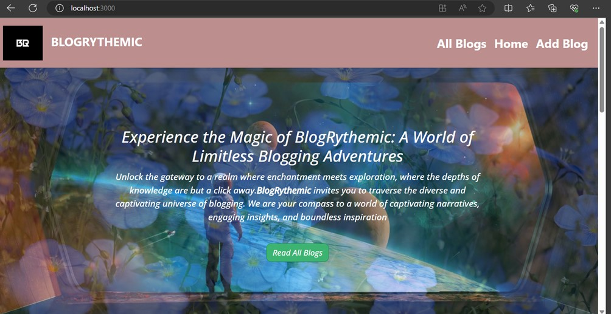
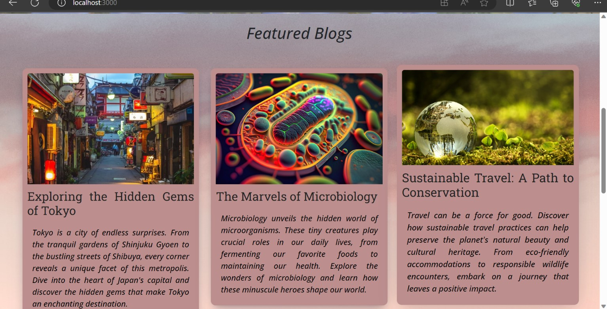
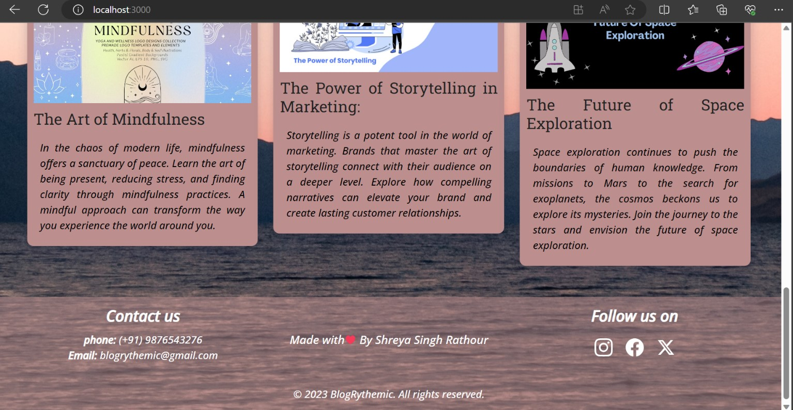

- Read All Blogs / All Blogs

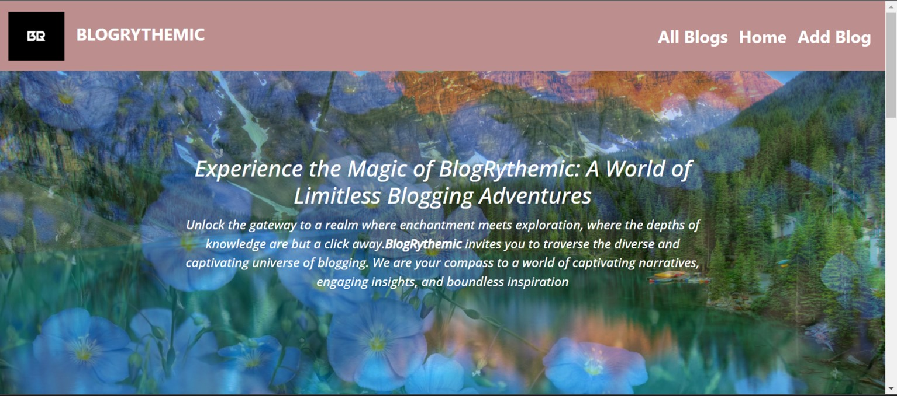
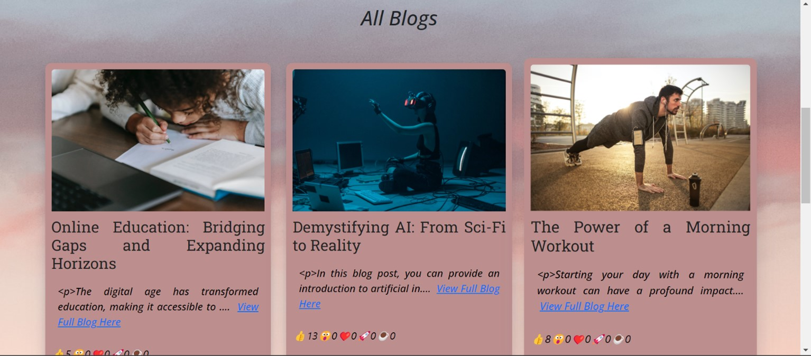
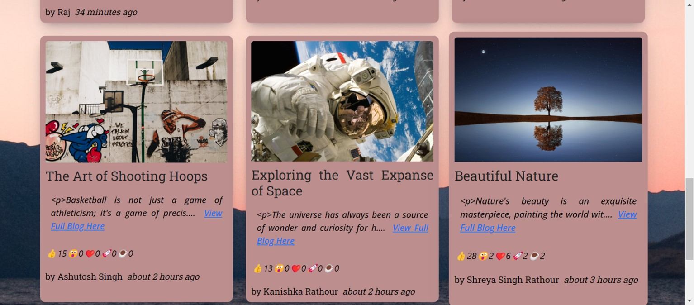
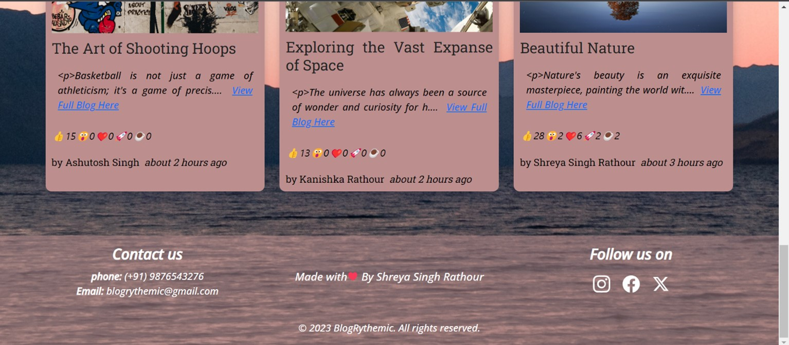

- Add Blog

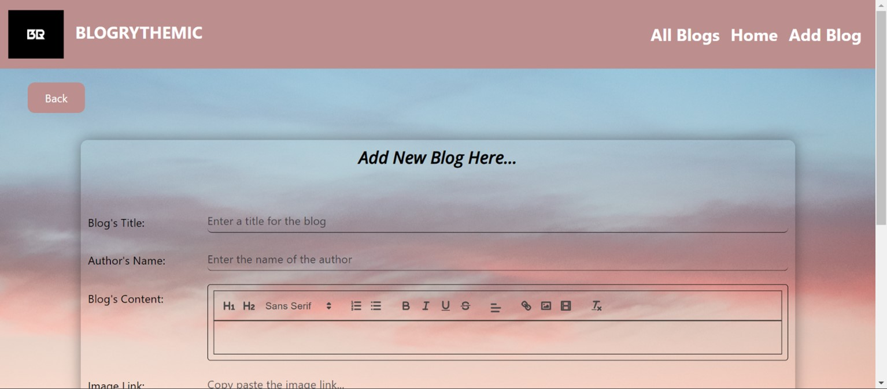
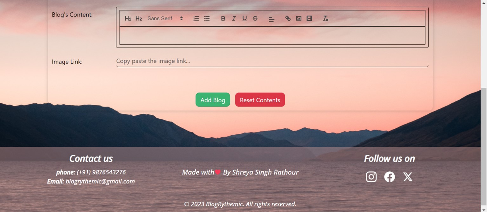

- Edit Blog

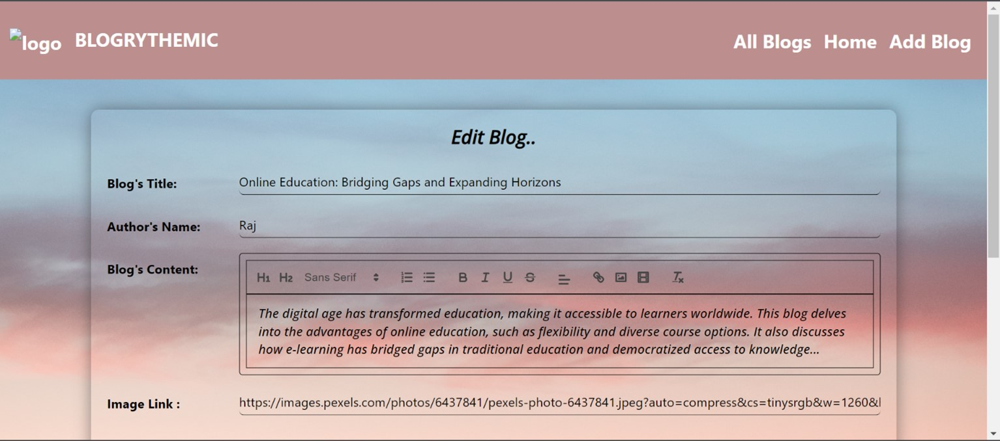

## Project Structure
- Project Structure
  
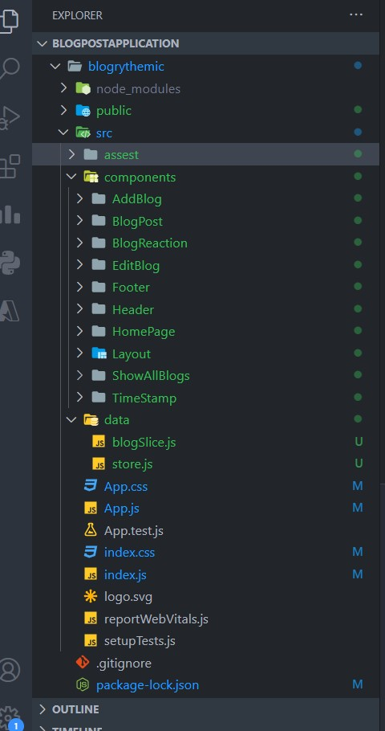
